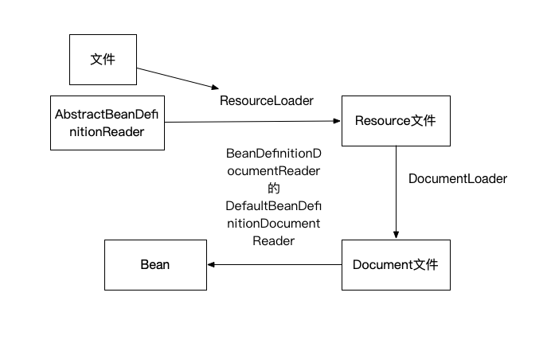
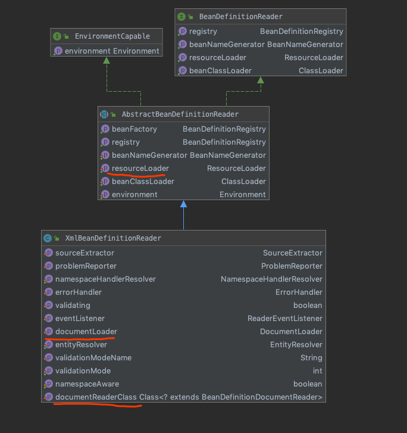

## 2.容器的基本实现
### XmlBeanDefinitionReader （读取xml文件）

1. 通过继承自 AbstractBeanDefinitionReader中的方法，来使用ResourceLoader装资源文件路径转换为对应的Resource文件
2. 通过DocumentLoader对resource文件进行转换，装resource文件转换为Document文件
3. 通过实现BeanDefinitionDocumentReader的DefaultBeanDefinitionDocumentReader类对Document进行解析，并使用BeanDefinitionParserDelegate对Element进行解析

## 10.事务
### 入口
1. TxNamespaceHandler
2. TransactionInterceptor.invoke